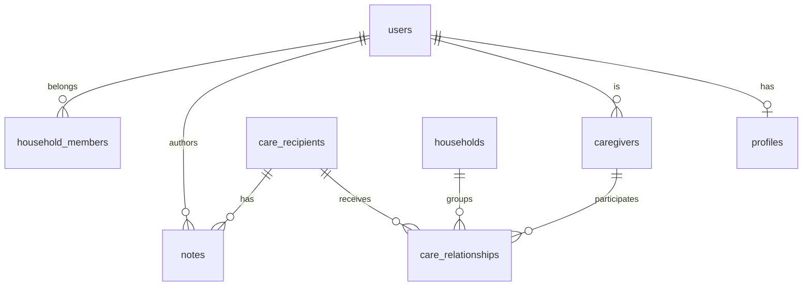

# CareNest — Database Design

**Status:** Design phase (Phase 9) — **no SQL implementation until design is approved**  
**Engine:** PostgreSQL via Supabase

---

## Design Principles

1. **`date_of_birth` not `age`** — age is always calculated in the application layer
2. **Row Level Security (RLS)** on every table
3. **Audit fields** on all mutable entities (`created_at`, `updated_at`, `created_by`)
4. **Soft delete** via `deleted_at` where appropriate
5. **Multi-caregiver / multi-recipient** supported via junction table
6. **Snake_case** table and column names

---

## Entity Relationship (Planned)



---

## Tables

### `users`

Synced from Supabase Auth. Do not store passwords.

| Column          | Type        | Notes                   |
| --------------- | ----------- | ----------------------- |
| `id`            | uuid PK     | Matches `auth.users.id` |
| `email`         | text        | From auth               |
| `auth_provider` | text        | `google`, `apple`       |
| `created_at`    | timestamptz |                         |
| `updated_at`    | timestamptz |                         |

### `profiles`

Extended user profile (caregiver's own profile).

| Column         | Type            | Notes    |
| -------------- | --------------- | -------- |
| `id`           | uuid PK         |          |
| `user_id`      | uuid FK → users | unique   |
| `display_name` | text            |          |
| `avatar_url`   | text            | nullable |
| `created_at`   | timestamptz     |          |
| `updated_at`   | timestamptz     |          |

### `care_recipients`

Person receiving care.

| Column               | Type        | Notes                                                |
| -------------------- | ----------- | ---------------------------------------------------- |
| `id`                 | uuid PK     |                                                      |
| `first_name`         | text        | required                                             |
| `last_name`          | text        | required                                             |
| `date_of_birth`      | date        | **not age** — calculate in UI                        |
| `gender`             | text        | enum: `male`, `female`, `other`, `prefer_not_to_say` |
| `health_description` | text        | free text for MVP                                    |
| `created_at`         | timestamptz |                                                      |
| `updated_at`         | timestamptz |                                                      |
| `deleted_at`         | timestamptz | soft delete                                          |

### `caregivers`

Links a user to their caregiver profile.

| Column          | Type            | Notes |
| --------------- | --------------- | ----- |
| `id`            | uuid PK         |       |
| `user_id`       | uuid FK → users |       |
| `first_name`    | text            |       |
| `last_name`     | text            |       |
| `date_of_birth` | date            |       |
| `gender`        | text            |       |
| `created_at`    | timestamptz     |       |
| `updated_at`    | timestamptz     |       |

### `households` (design now, MVP may use 1:1)

Family unit for shared access.

| Column       | Type        | Notes             |
| ------------ | ----------- | ----------------- |
| `id`         | uuid PK     |                   |
| `name`       | text        | e.g. "Mom's Care" |
| `created_at` | timestamptz |                   |

### `household_members`

| Column         | Type    | Notes             |
| -------------- | ------- | ----------------- |
| `id`           | uuid PK |                   |
| `household_id` | uuid FK |                   |
| `user_id`      | uuid FK |                   |
| `role`         | text    | `owner`, `member` |

### `care_relationships`

Junction: caregiver ↔ care recipient.

| Column              | Type        | Notes                  |
| ------------------- | ----------- | ---------------------- |
| `id`                | uuid PK     |                        |
| `caregiver_id`      | uuid FK     |                        |
| `care_recipient_id` | uuid FK     |                        |
| `household_id`      | uuid FK     | nullable for MVP       |
| `role`              | text        | `primary`, `secondary` |
| `is_primary`        | boolean     |                        |
| `created_at`        | timestamptz |                        |

### `notes`

| Column              | Type            | Notes                           |
| ------------------- | --------------- | ------------------------------- |
| `id`                | uuid PK         |                                 |
| `care_recipient_id` | uuid FK         |                                 |
| `author_id`         | uuid FK → users |                                 |
| `content`           | text            |                                 |
| `type`              | text            | `manual`, `voice`, `ai_summary` |
| `created_at`        | timestamptz     |                                 |
| `updated_at`        | timestamptz     |                                 |
| `deleted_at`        | timestamptz     | soft delete                     |

### `note_revisions` (recommended)

Audit trail for note edits — important for care liability.

| Column       | Type            | Notes            |
| ------------ | --------------- | ---------------- |
| `id`         | uuid PK         |                  |
| `note_id`    | uuid FK         |                  |
| `content`    | text            | previous content |
| `revised_by` | uuid FK → users |                  |
| `revised_at` | timestamptz     |                  |

### `audit_logs` (recommended)

| Column        | Type        | Notes                                |
| ------------- | ----------- | ------------------------------------ |
| `id`          | uuid PK     |                                      |
| `user_id`     | uuid FK     |                                      |
| `action`      | text        | `create`, `update`, `delete`, `view` |
| `entity_type` | text        | `note`, `care_recipient`, etc.       |
| `entity_id`   | uuid        |                                      |
| `metadata`    | jsonb       |                                      |
| `created_at`  | timestamptz |                                      |

---

## Indexes (Planned)

| Table                | Index                                  | Purpose                |
| -------------------- | -------------------------------------- | ---------------------- |
| `notes`              | `(care_recipient_id, created_at DESC)` | Timeline queries       |
| `notes`              | GIN `to_tsvector('english', content)`  | Full-text search       |
| `care_relationships` | `(caregiver_id)`                       | Caregiver's recipients |
| `care_relationships` | `(care_recipient_id)`                  | Recipient's caregivers |
| `users`              | `(email)`                              | unique                 |

---

## RLS Policy Sketches

| Table             | Policy                                                         |
| ----------------- | -------------------------------------------------------------- |
| `profiles`        | Users read/update own row only                                 |
| `care_recipients` | Access via `care_relationships` where user is linked caregiver |
| `caregivers`      | Users read/update own caregiver row                            |
| `notes`           | Read/write if user has relationship to note's care_recipient   |
| `households`      | Members of household only                                      |

All policies use `auth.uid()` as the identity anchor.

---

## Age Calculation

```js
// utils/helpers/formatAge.js
// calculateAge(dateOfBirth) → number
// Used in UI only — never stored in database
```

Onboarding forms collect **date of birth** (or birth year + month if UX requires simplification). Display age as derived value.

---

## Migration Strategy (Phase 10)

1. Create `supabase/migrations/` in repo
2. Implement tables in dependency order: users → profiles → care_recipients → caregivers → relationships → notes
3. Enable RLS before any production data
4. Seed script for staging only

---

## Related Documents

- [API.md](./API.md)
- [Security.md](./Security.md)
- [Compliance.md](./Compliance.md)
